# The architecture, drawn — and where it should go next

> **Status: HISTORY. Superseded by [ADR-0004](adr/0004-from-services-to-a-module.md).**
>
> This document describes a seven-service architecture that no longer exists. The services
> were collapsed into one embeddable module — see [module.md](module.md) for what runs now.
> Every path, port and container named below is stale.
>
> It is kept because the REASONING is not stale. The seams it argues for are the seams the
> module still has, and they are why undoing the split cost so little: `wiring.py` builds an
> orchestrator out of local objects where a service built one out of HTTP clients, and
> nothing in between changed. Read it for why the boundaries are where they are, not for
> where the code is.
>
> *(Original status: Part 1 was the baseline of five services; Part 2 proposed seven, and
> most of it shipped — `competency-scope`, scoped assessments, `bank-ingest`, and the SQL
> store with its parity suite.)*

Two halves.

**Part 1** draws the system as it runs today: one engine library, five service adapters over
it, three shared packages, and no database anywhere. It traces the two flows that matter — a
bank arriving, and an assessment running against one of the checked-in banks — down to the
level of which service holds which cache and what happens when each one fails.

**Part 2** proposes an evolution. A bank can be **uploaded** as a file. A small service
**ingests** it into a database, with every question's competency and sub-competency as rows
rather than as strings inside a blob. An assessment can be invoked **on selected
competencies** instead of on a whole bank. And a second small service **induces the
sub-graph** of that selection and resolves which items measure it.

The diagrams are mermaid, which is new in this repository — everything else in `docs/` is
ASCII in a fenced block. Three of these are sequences across four services and one is a
schema; an arrow diagram maintained by hand is an arrow diagram that goes stale.

Read [architecture.md](architecture.md) for the measurement and
[microservices.md](module.md) for the seams. This file assumes both and goes wider
rather than repeating them.

---

# Part 1 — The engine, and the five services it was split into

**Read this as the baseline, not as an inventory of what is deployed.** Two more services —
`bank-ingest` and `competency-scope` — have shipped since, and they are documented in Part 2
where the reasoning for them lives. Seven run today; `docs/module.md` is the
authoritative list.

Part 1 describes the five that came out of the original split, because everything in Part 2
is a change *to* them and reads as arbitrary without it.

## 1.1 The shape: one library, five adapters, three shared packages

The single most important structural fact is that **the psychometrics are a library, not a
service**. `backend/app/` is installed into every image as `adaptive-engine` and imported
under the name `app`. Each service is an adapter over the slice of it that service owns.

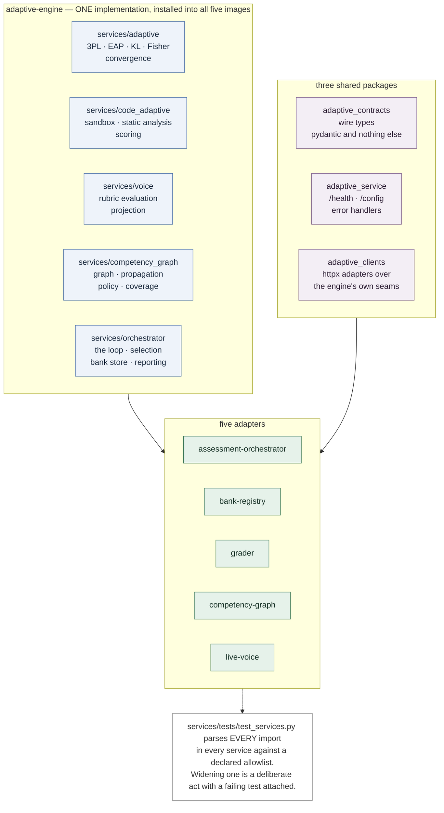

Why a library and not five copies: the 3PL core, the fractional likelihood and the stopping
rule are where two implementations drifting apart is a **measurement** problem rather than a
maintenance one — two candidates scored by different arithmetic, with nothing comparing
them. Copying the engine per service would create five copies that drift.

Why the packages are three rather than one:

| package | contains | why separate |
|---|---|---|
| `adaptive_contracts` | the wire types, `SCHEMA_VERSION` | deliberately anaemic — depends on pydantic and nothing else, so a generated frontend client can install it without numpy, a sandbox client and 600 KB of question banks |
| `adaptive_service` | the shared `/health` and `/config` router, `ServiceError`, error handlers | started as five duplicated copies of a four-line redaction filter; became shared the moment it grew a rule — the engine config fingerprint |
| `adaptive_clients` | `httpx` clients plus the engine-shaped adapters (`HttpUnifiedBank`, `HttpGrader`, `HttpGraphSource`) | `adaptive_clients.engine` is the only module in it that imports the engine, and the package root does not import that module |

`backend/evaluation/` imports the same library **in-process** and is a test instrument, not
a component. Driving 36,000 simulated sessions through HTTP is not affordable, and that is
the whole reason it is not a service.

## 1.2 The containers

Five services on one bridge network, two external dependencies on the hot path, no database.

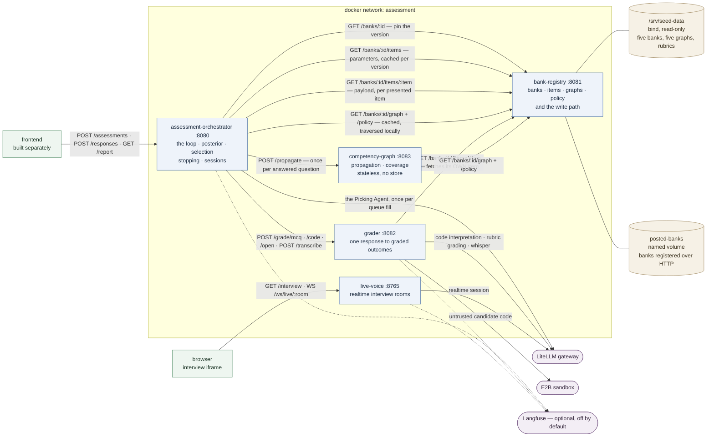

Egress is a property to read off the diagram rather than infer, because a network policy is
written from it:

| service | may reach | must not reach |
|---|---|---|
| `assessment-orchestrator` | `bank-registry`, `grader`, `competency-graph`, **the model gateway** | the sandbox |
| `bank-registry` | **nothing at all** | everything |
| `grader` | `bank-registry`, the model gateway, **the sandbox** | the orchestrator |
| `competency-graph` | `bank-registry`, and nothing else | **any model, any store** |
| `live-voice` | the model gateway | every service in this repository |

`bank-registry` and `live-voice` do not even have `adaptive_clients` installed in their
images — their inability to call anything is a packaging fact, not a convention.

The orchestrator's model egress is the entry that surprises people, and
[ADR-0002](adr/0002-engine-as-a-library.md) exists partly to correct it. ADR-0001 said the
grader would be the only component needing egress. The Picking Agent calls a model on every
queue fill, and a network policy written from the old sentence makes selection fall back to
the deterministic choice on every single question — a legitimate degraded mode, and
therefore one that raises no error, logs nothing alarming and alerts nobody.

## 1.3 The original five, one at a time

### `bank-registry` — :8081

Owns banks, items, competency graphs, the resolved propagation policy, and the write path.
Reaches nothing. It is the only service with durable state.

| method | path | returns |
|---|---|---|
| GET | `/banks` | every registered bank, seeded or posted |
| GET | `/banks/{id}` | one profile and its version. `ETag: "<version>"` |
| GET | `/banks/{id}/items` | **item parameters only** — `a`, `b`, `c`, measured variables, estimated time. No stem, no options, no key |
| GET | `/banks/{id}/items/{item_id}` | one item **including its payload** |
| GET | `/banks/{id}/graph` | the competency graph, policy already applied |
| GET | `/banks/{id}/policy` | the resolved propagation policy, per edge, with reasons |
| GET | `/banks/{id}/coverage` | item counts per main competency and modality |
| GET | `/banks/{id}/parity` | which modality wins each variable's ranking, and why |
| POST | `/banks/validate` | the same checks as a registration, no write |
| POST | `/banks` | register a new bank. 409 on an existing id |
| PUT | `/banks/{id}` | replace one, creating a new version |
| DELETE | `/banks/{id}` | deregister a posted bank; a shadowed seed reappears |

**Two read paths, on purpose.** A caller that only ranks should not be able to read a
question, and that is a property of *which endpoint it is allowed to call* rather than of
what it chooses to look at. The orchestrator uses the first for every decision and the
second only for the item it is about to present. The grader uses only the second.

**The store has two layers.** `seed` — the five checked-in banks under `ENGINE_DATA_DIR`,
read-only. `stored` — `BANK_STORE_DIR`, writable, one directory per bank holding
`bank.json`, `graph.json` and `profile.json`. Stored shadows seed on the same id, which is
what makes a checked-in bank replaceable without deleting it, and why replacing one is a PUT
rather than a POST.

The five seeds and why each carries the coverage policy it does:

| bank | title | items | graph | mains | `coverage_critical_only` |
|---|---|---:|---|---|---|
| `DA` | Prepare and Analyze Data | 34 | 7 nodes / 15 edges | `DA` | default — six sub-nodes against a twelve-question cap |
| `PY` | Python Engineering | — | 11 / 19 | `PY` | default |
| `AIE` | AI Engineer | 300 | 36 / 67 | C1, C3, C6 | **true** — C6 has 19 subs against a cap of 12 |
| `AIE-JR-V3` | Junior AI Engineer v3 | 60 | 4 / 3 | C1 | false |
| `JAI-600` | Junior AI Engineer 2026 | 600 | 28 / 22 | C1–C6 | false |

### `assessment-orchestrator` — :8080

Owns the loop, the posterior, selection, stopping, sessions and the candidate boundary.

| method | path | notes |
|---|---|---|
| GET | `/banks` | proxied to the registry, so a frontend has one base URL |
| POST | `/assessments` | begin. Pins bank id **and version** to the session |
| GET | `/assessments/{id}` | current state: the presented item, or the report |
| GET | `/assessments/{id}/next` | just the question. **409** once stopped |
| POST | `/assessments/{id}/responses` | JSON, or multipart with an `audio` file |
| GET | `/assessments/{id}/report` | **409** while still running |
| DELETE | `/assessments/{id}` | discard |
| GET | `/assessments/{id}/diagnostics` | posteriors, shortlist, reasoning. **404 unless `AUTHOR_DIAGNOSTICS_ENABLED`** |
| GET | `/assessments/{id}/state` | the raw state. Same gate |

The bank id travels with the *session*, not with each request. A client that began against
one bank must not be able to answer it against another, and re-sending the id every call
would make that possible by omission.

One `Orchestrator` is built per `(bank_id, version)` and reused. Not per bank: a bank
replaced through `PUT` produces a new version, and a session already running must keep the
pool it began with — items disappearing from a queue that already ranked them is not a
change any candidate consented to.

### `grader` — :8082

Owns one response becoming graded outcomes, per modality. The only component that executes
anything.

| method | path | who decides |
|---|---|---|
| POST | `/grade/mcq` | **code alone** — exact index comparison. No model is involved and none ever will be: a model that graded multiple choice could disagree with the bank about its own answer key |
| POST | `/grade/code` | **code + model** — tests, static analysis, model interpretation, in the measured split below |
| POST | `/grade/open` | rubric evaluation (a model call) then a deterministic projection onto competencies. `open` and `voice` grade identically |
| POST | `/transcribe` | audio to text. Separate from grading because the two fail differently — a transcription failure is a retry, a grading failure is an unscorable response that must move no estimate |
| GET | `/trial/{bank}/{item}/public-tests` | the example cases a candidate may run against |
| POST | `/trial/code` | run a candidate's code against the public cases. **Grades nothing**, and there is no code path from here into a learner model |

Code scoring under the shipped approach (`CODE_APPROACH=B`), per criterion:

| criterion | tests | static | model |
|---|---:|---:|---:|
| functional correctness | 1.00 | — | — |
| edge case handling | 0.80 | 0.05 | 0.15 |
| algorithm choice | 0.35 | 0.30 | 0.35 |
| code quality | — | 0.30 | 0.70 |

Sources absent from a submission are dropped and the remainder renormalised, so a missing
source never silently scores zero. A sandbox failure produces outcomes of **weight 0**,
which move nothing.

### `competency-graph` — :8083

Owns propagation, coverage and the manifest. Holds **no state** and has **no egress** except
the registry.

| method | path | notes |
|---|---|---|
| POST | `/propagate` | apply one response's outcomes to the graph, all or nothing. Idempotent — evidence ids are deterministic |
| GET | `/manifest/{bank_id}` | the propagation configuration in force, and its hash |
| POST | `/coverage` | which required sub-competencies of a main still lack **direct** evidence |

The plan in `MIGRATION.md` had this service owning per-session node state. It does not, and
that reversal is recorded in ADR-0002. The property the whole architecture rests on is that
the orchestrator holds nothing between calls, so an assessment can be persisted between
requests and resumed on a different worker — and that only works while `AssessmentState` is
the single source of truth. A graph service keeping its own copy of the same session's node
state creates a second one, and the two disagree the first time a request is retried.

### `live-voice` — :8765

Owns realtime interview rooms and the page they are embedded in. It talks to the browser and
to the model gateway, and to no service in this repository.

| method | path | notes |
|---|---|---|
| POST | `/api/live/rooms` | open a room, returns `room_id` and `ws_path` |
| WS | `/ws/live/{room_id}` | duplex: candidate PCM up, interviewer PCM down, JSON events |
| GET | `/api/live/rooms/{id}` | status, turns, and the finished transcript package |
| GET | `/api/live/config` | turn-taking and audio-gating parameters for the browser |
| GET | `/api/live/debug` | recent room events. **404 unless `LIVE_DEBUG_API_ENABLED`** — it carries transcripts |
| GET | `/interview`, `/chat` | the embedded pages |

The room **does not grade**. A finished interview is submitted as an ordinary
`POST /assessments/{id}/responses` with `{"type": "voice", "transcript": "..."}`.

The port is 8765 because that is the port the monolith's helper used and `/interview` is
embedded by URL.

## 1.4 What crosses the wire, and what deliberately does not

| | where it happens | why |
|---|---|---|
| item parameters | **cached** in the orchestrator, per bank version | selection ranks the whole pool on every step; a fetch per decision puts the network inside a 100 ms loop |
| item payloads | fetched per presented item | large, and selection is not allowed to read them |
| grading | the grader, which fetches its own item | the answer key never transits the orchestrator |
| graph traversal | **local**, per bank version | read on every candidate on every step |
| graph propagation | `competency-graph` | once per answered question, beside a 500 ms–30 s grading call |
| the coverage gate | **local**, against the cached graph | evaluated for every competency after every response |
| the propagation manifest | built locally at `begin` and per response | drift against the service's own answer is what it exists to detect |

The last two are worth noting because the endpoints exist and are not called on the hot
path. `POST /coverage` and `GET /manifest/{id}` are available for an operator or a second
implementation to check against; the live loop uses the cached graph, deliberately.

## 1.5 Flow A — a bank arrives

Today a bank is registered by POSTing JSON. There is no file upload and no database: it
lands as three files in a volume.

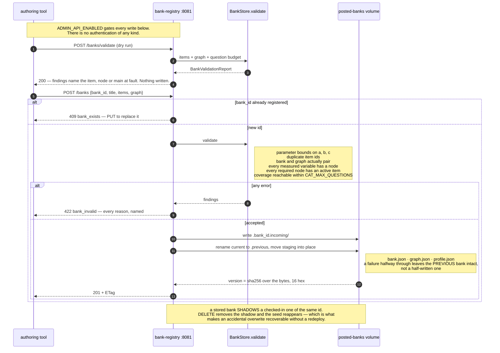

**The checks are not registry politeness.** They are the same invariants the engine's own
suite asserts of the five checked-in banks, because otherwise that suite is testing the seeds
rather than the system. Two of them are worth spelling out, because they are the ones a
plausible-looking bank fails:

- **`coverage_unreachable`** — a main requiring more sub-competencies than
  `CAT_MAX_QUESTIONS − 2`. The coverage gate could never be satisfied and every session
  would end on the budget escape. Caught at registration rather than discovered in
  production as "assessments seem to always run to the cap".
- **`graph_bank_mismatch`** — a bank paired with a graph authored for a different bank. The
  coverage gate then asks a foreign graph what a competency requires, marks every required
  node unmeasured, and vetoes convergence for the whole session.

**The version is a content hash over the bytes**, not an mtime — so two processes and two
machines agree, and a container rebuild does not invalidate every cache for no reason. An
assessment pins the version it began under, so `PUT` changes what the *next* session sees
and nothing about one already running.

## 1.6 Flow B — beginning an assessment

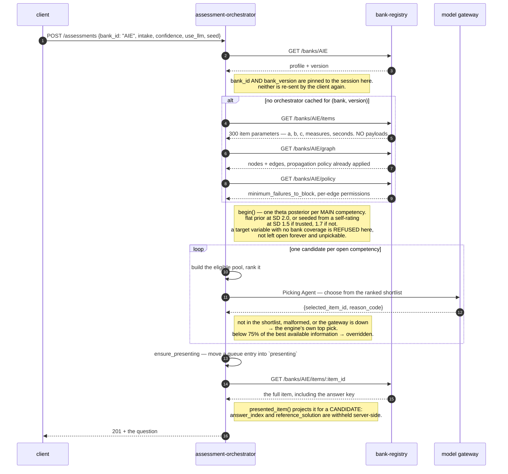

`POST /assessments` refuses with **503 `capacity_reached`** rather than evicting a live
session when the store is full. Failing closed is the correct direction here: a new
candidate waiting is recoverable, a candidate mid-assessment losing their session is not.

## 1.7 Flow B — one response

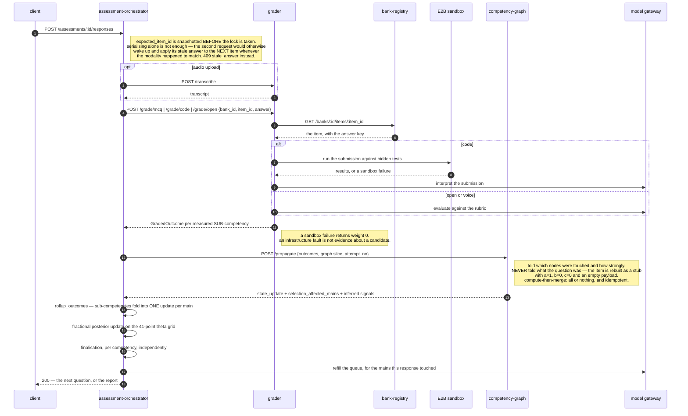

**The order is not the intuitive one, and it matters.** Propagation runs *before* the
posterior update, on the raw sub-competency outcomes:

```text
grade → propagate → rollup → posterior update → finalisation → refill
        graph only  sub→main   fractional        per competency  only touched mains
```

That ordering is part of what keeps the graph out of the measurement. `InferredSignalDTO`
carries no `score` field and no `weight` field, so a deduction *from* a response cannot come
back as a second response — measured at **1.80× weight inflation** on the specification's own
worked example, with the damage landing on the standard error, which is what the assessment
stops on. The worst a compromised or buggy graph service can do is change which question is
asked next.

## 1.8 Inside selection: how one item is chosen

This is the part that is entirely local, entirely deterministic except for one call, and
budgeted at 100 ms.

```mermaid
flowchart TB
    A["shortlist(variable) — active items with loading > 0,<br/>across ALL modalities, minus served and already-queued"]
    B["time admissibility — reserve the other open competencies'<br/>unmet modality minimums; drop what no longer fits the clock"]
    C{"coverage gate on?"}
    D["narrow to items measuring an UNMEASURED REQUIRED node"]
    E{"a blocked node<br/>worth probing?"}
    F["unblocking probe pool"]
    G["modality blueprint deficit — if the blueprint and the<br/>narrowing cannot both hold, the BLUEPRINT wins"]
    H["corroboration / upper-band challenge"]
    I["rank: information x expected_weight x graph_modifier / minutes"]
    J["randomesque exposure control — uniform draw over the top K"]
    K["shortlist of N"]
    L{"use_llm and<br/>more than one candidate?"}
    M["Picking Agent — pick one, with a reason code"]
    N["engine choice = shortlist[0]"]
    O{"in the shortlist,<br/>and >= 75% of<br/>best utility?"}
    Q["QueuedCandidate — records information, utility, best_utility,<br/>normalized_regret, engine_top_pick, chosen_by_llm, reason_code"]

    A --> B --> C
    C -- yes --> D --> E
    C -- no --> E
    E -- yes --> F --> G
    E -- no --> G
    G --> H --> I --> J --> K --> L
    L -- yes --> M --> O
    L -- no --> N --> Q
    O -- yes --> Q
    O -- no --> N

    classDef code fill:#eef3fa,stroke:#4a6fa5,color:#1c2b3f
    classDef llm fill:#f3eef5,stroke:#7d5f8a,color:#2f2136
    classDef dec fill:#f6f1e6,stroke:#9a8358,color:#3c3320
    class A,B,D,F,G,H,I,J,K,N,Q code
    class M llm
    class C,E,L,O dec
```

The ranking key, in full:

```text
information(item, state, variable)   KL while observations < 3, expected Fisher after,
                                     times the item's loading on this variable
  x  expected_weight_for(modality)   how much evidence a response in this modality carries,
                                     measured from the session corpus where one exists
  x  max(0.01, 1 + graph_modifier)   the graph may nudge, never zero out
  /  max(minutes, 1e-9)              information per minute, not information
```

**Which competency gets the next question** is separate and also deterministic: the lowest
certainty among open competencies that have a candidate ready, with a competency whose queued
candidate would *close a coverage requirement* jumping ahead of it. Ties break on fewest
observations, then on name.

**The one model call in the whole loop is this pick**, and it is bounded four ways: it may
only choose from a shortlist the engine ranked; an id outside that shortlist is discarded; a
pick below 75% of the best available information is overridden; and any failure at all —
gateway down, malformed JSON, missing key — falls back to the engine's own top choice. It
does not grade multiple choice, write an estimate, choose a competency, or stop an
assessment.

## 1.9 Inside measurement: how a response becomes evidence

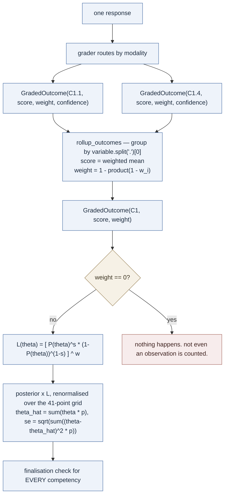

Two properties earn the fractional likelihood its place. **It reduces exactly**: at
`s ∈ {0,1}` and `w = 1` it *is* the MCQ engine's Bernoulli likelihood, term for term, and
the test suite asserts float equality against `irt.posterior_update` to keep it that way.
**Zero weight means zero update**: `w = 0` makes `L` identically 1, so the rule that an
infrastructure failure must never move a candidate's estimate falls out of the arithmetic
rather than being special-cased at each call site. It cannot be forgotten at a call site
because there is nothing to forget.

Finalisation runs for every competency after every question, in this precedence:

| # | rule | converged | condition |
|---|---|---|---|
| 0 | `band_probability` | yes | the reported band's posterior mass clears the threshold |
| 1 | `precision` | yes | `SE ≤ CAT_SE_TARGET`, a minimum question count, and difficulty corroborated |
| 2 | `stable_band` | yes | `SE` under the stability ceiling and the band unchanged across the window |
| 3 | `bank_exhausted` | **no** | nothing left to ask |
| 4 | `question_budget` | **no** | `CAT_MAX_QUESTIONS` reached |

Two gates can hold a *converged* competency open: an unmet **modality blueprint** minimum,
and the **coverage gate** — a main may not claim convergence while a required sub-competency
has no direct evidence. When coverage cannot be satisfied, the competency finalises as
`graph_gates_waived`, deliberately not as `question_budget`, so the reason is legible
afterwards.

And the session stops on four deterministic checks — `all_variables_finalised`,
`time_limit`, `item_budget`, `no_candidates_available`. **A model can never stop an
assessment.**

## 1.10 Where state lives

This is the diagram that motivates Part 2.

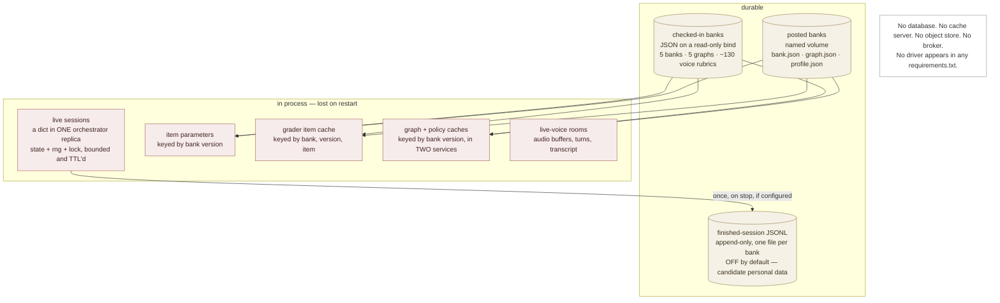

Two consequences are already recorded as known limits:

**Sessions are bound to one replica.** Run one, or use sticky sessions. `AssessmentState` is
serialisable by construction — the 41-point posterior is carried as a `list[float]`
specifically so it round-trips through JSON — so the seam for a store exists and nothing has
to move when one arrives. What does not exist is a decision about where candidate response
data lives, for how long, and under whose retention policy. Inventing one inside a refactor
would be the wrong way to make it.

**Every completed assessment is lost at restart** unless `CAT_SESSION_DUMP_DIR` is set, and
it is set nowhere in the shipped deployment. Which means the graph's central claim — that a
prerequisite edge predicts anything — has never been checkable against real candidates.

## 1.11 The competency model, and the half of it the engine reads

AIE: 36 nodes, 67 edges, 300 active items (150 MCQ, 75 code, 75 voice). Below is C1 and its
neighbourhood; C3 has 11 sub-competencies and C6 has 19, drawn the same way.

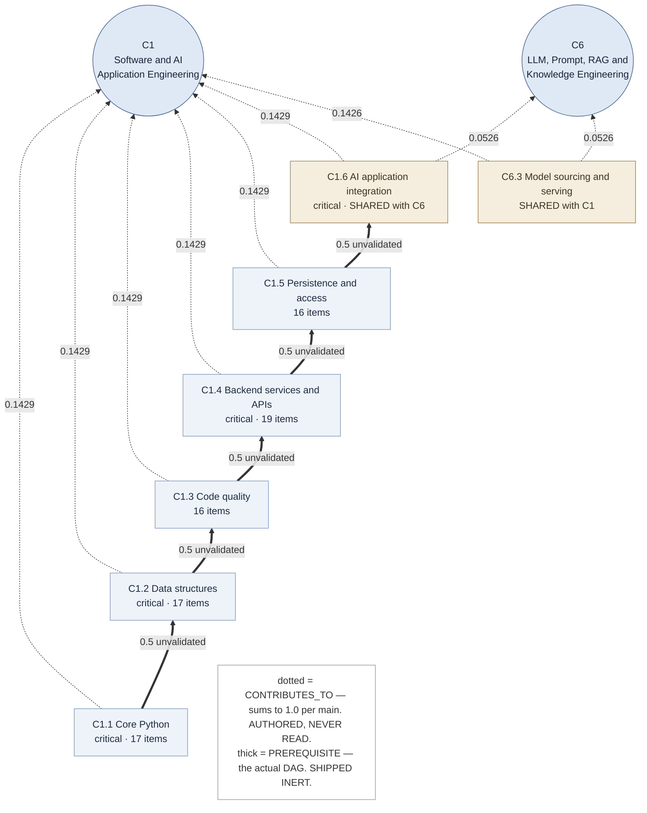

Four things this makes visible, none obvious from reading the file:

**`CONTRIBUTES_TO` edges are authored and never consumed.** The index builder skips every
non-`PREREQUISITE` edge outright, and the model's own comment says so: *"CONTRIBUTES_TO:
weight/loading contribution (used later)."* Sub-to-main membership comes from
`node.main_competencies`, or the `X.N` id prefix as a fallback. **Every weight on those
dotted edges is, today, documentation.**

**The rollup to a main uses the item's weights, not the graph's.** `rollup_outcomes` groups
by `variable.split(".")[0]` and combines with `1 − Π(1 − wᵢ)` over the item's own
`measures[].weight`. The two `loading`s described in
[competency-graph.md](competency-graph.md) are genuinely different quantities — item-to-node
weights are not normalised and have no sum constraint; node-to-main weights sum to 1.0 — and
only the first is wired up.

**Shared nodes are real.** `C1.6` and `C6.3` each serve two mains; so do `C3.9` and `C3.10`
into C6. One node holds one authoritative state, and every main it contributes to is
recalculated from it.

**The DAG ships inert.** Those `PREREQUISITE` edges encode authored numbering order and
nothing else. A completed screening study measured upward inference wrong **22.4%** of the
time against a 3% gate, and downward blocking at **8.7%** false blocks against a 2% gate with
a 14.6% structural floor. They are disabled at the bank level as well as the deployment
level, so a deployment that enables propagation globally does not enable it here, and every
edge carries `validation_status: unvalidated`.

What the graph *does* do today is the **coverage gate**. AIE runs `critical_only` because C6
declares nineteen sub-competencies against a twelve-question cap — full coverage could never
be satisfied, so every session would end on the budget escape. Hold that; it returns in
Part 2 as an argument *for* scoping.

## 1.12 How it degrades

The error taxonomy is two classes, and the distinction drives the HTTP status a candidate
sees:

| class | means | orchestrator's response |
|---|---|---|
| `ServiceUnavailable` | unreachable or failed. Retryable, sometimes degradable | **503**, nothing recorded — the candidate retries the same item |
| `ServiceRefused` | answered, and the answer is that the request was wrong | **422** carrying the dependency's own reason |

| what fails | what happens | is it silent? |
|---|---|---|
| model gateway | selection falls back to the engine's top pick; code and rubric grading lose their model term | **yes** — this is the degraded mode ADR-0002 warns about |
| E2B sandbox | code outcomes come back at weight 0; no estimate moves | no — flagged on the response |
| `competency-graph` | `applied=False`; the session continues with the graph layer inert for that response | partially — visible in state, not an error |
| `bank-registry` | the orchestrator cannot begin a session; a running one continues from cache until it needs a payload | no — 503 |
| `grader` | 503, nothing recorded, same item retryable | no |
| orchestrator restart | **every in-flight session is lost** | no — but unrecoverable |

Timeouts are chosen per dependency rather than globally: 10 s to the registry, 5 s to the
graph service (*"if it takes longer than this something is wrong, and the correct answer is
to continue without the graph rather than keep a candidate waiting"*), 120 s to the grader —
above the sandbox's own 30 s rather than racing it.

## 1.13 Configuration, the fingerprint, and deployment

**Engine policy must be identical across services, and nothing structural makes it so.** A
grader running `CODE_APPROACH=C` beside an orchestrator that believes it is `B` produces a
session whose scores were computed one way and whose stopping rule assumed another —
internally consistent, entirely wrong, and no request fails. So the policy variables are
declared **once** in `deploy/docker-compose.yml`, and every service reports an
`engine_config_fingerprint` on `/health` — twelve hex characters over the 40 settings that
decide what a candidate is scored by. Two services with different fingerprints are not
running the same assessment.

Deliberately excluded from the fingerprint: URLs, keys, log levels, retention windows. A
fingerprint that flagged a log-level change would be ignored within a week.

`adaptive_contracts.SCHEMA_VERSION` is reported the same way. It bumps when a field is
**removed** or its meaning changes; additive fields do not. The suite asserts all five
services report the same one — a version nobody compares is decoration.

Every image: build context is the repository root (so each can install contracts, engine and
common), layers ordered by change frequency, non-root `uid 10001`, and a `HEALTHCHECK` in the
Dockerfile rather than in compose.

The budget the split had to respect, and what it actually cost:

| step | budget | note |
|---|---|---|
| grading | 500 ms MCQ / 30 s code | sandbox-bound; the session cap already accounts for it |
| graph propagation | 50 ms + one hop | |
| posterior update | 5 ms | 41-point vector |
| selection | 100 ms | ranks the whole eligible pool, entirely local |
| **added by the split** | **< 150 ms** | the 90-minute cap is binding and P90 already sits at 83 |
| **measured** | **p90 24 ms, p50 20 ms** | 30 MCQ responses across 6 sessions, one machine |

That measurement covers a *whole* response — the grader hop, which itself fetches the item
from the registry, the propagation hop, MCQ grading and the selection refill. In the monolith
all of it was function calls. Re-measure on the target cluster before believing it there; a
same-host Docker network is the optimistic case.

---

# Part 2 — The proposal

## 2.1 What is being asked, and the exact gap

1. A bank can be **uploaded** as one file — the questions, and nothing else.
2. A small service **ingests** it into a database — every question, with its competency and
   its sub-competency, as rows rather than as strings in a blob — and **derives** the
   competency graph from those questions, because the author never uploads one.
3. An assessment can be invoked **on selected competencies**, not on a whole bank.
4. A second small service **induces the sub-graph** of that selection and resolves which
   questions relate to it.

Point 3 has a hard edge today. `POST /assessments` already accepts `target_variables`, but
`Orchestrator.begin` checks them against `bank.variables()`, which returns **main
competencies only** — it maps every measured variable through `variable.split(".")[0]` and
returns the distinct mains. So:

```text
{"target_variables": ["C1", "C3"]}       →  works
{"target_variables": ["C1.1", "C1.4"]}   →  400  no bank coverage for: ['C1.1', 'C1.4']
```

Sub-competencies exist in three places — the graph's nodes, each item's `measures`, and the
coverage gate — but never as something a caller can ask for. Points 1, 2 and 4 have no
implementation at all: the write path takes JSON in a request body, the store is a directory
of files, and nothing anywhere induces a sub-graph.

## 2.2 The containers, after

Two new services and a database. The existing five keep their ports, their contracts and
their seams.

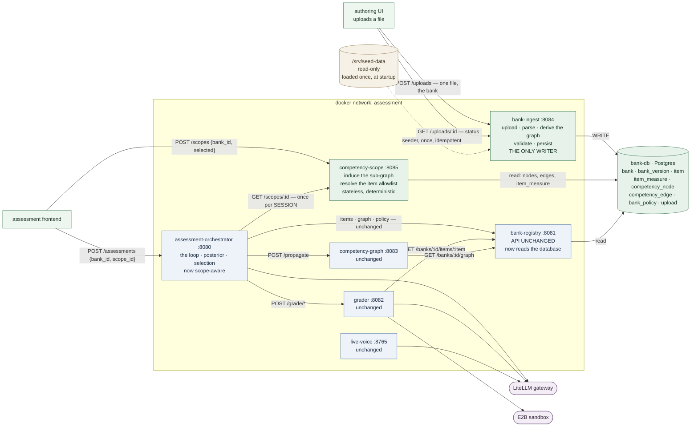

| new component | port | owns | egress | state |
|---|---|---|---|---|
| `bank-ingest` | 8084 | upload, parse, **derive the graph**, validate, persist. **The only writer.** | the database | the raw upload bytes |
| `competency-scope` | 8085 | induces the sub-graph of a selection; resolves the item allowlist | the database | **none** — a pure function of its inputs |
| `bank-db` | 5432 | banks, versions, items, item-to-node measures, nodes, edges, policy, uploads | — | everything durable |

Both new services are small in the sense that matters: `bank-ingest` is a file handler
wrapped around validation code that already exists, and `competency-scope` is a graph
traversal and two queries. Neither contains any psychometrics, and neither can move a
posterior.

The revised egress table — the row that changes is `bank-registry`, which today can reach
nothing at all:

| service | may reach | changed? |
|---|---|---|
| `bank-ingest` | **the database** | new |
| `competency-scope` | **the database** | new |
| `bank-registry` | ~~nothing~~ → **the database** | **yes — a network policy must change** |
| `assessment-orchestrator` | registry, grader, graph, model gateway, **`competency-scope`** | one addition |
| `grader`, `competency-graph`, `live-voice` | unchanged | no |

## 2.3 `bank-ingest` — the only writer

**One writer, many readers.** That is worth more here than it usually is, because the thing
being written is the thing a live assessment is measuring against. Today the write path sits
inside the service that also serves candidate-facing reads, gated only by an environment
variable.

| method | path | notes |
|---|---|---|
| POST | `/uploads?bank_id=` | one file. Parse, derive, validate, write. **201** with the receipt |
| POST | `/uploads/validate?bank_id=` | the identical path with the write omitted. **Writes nothing** |
| PUT | `/uploads/{bank_id}` | replace a bank, creating a new version |
| GET | `/uploads/{upload_id}` | what one upload became, and why |
| GET | `/uploads` | recent uploads, newest first, for an authoring UI's history view |
| DELETE | `/banks/{bank_id}` | deregister an uploaded bank; a seed underneath reappears |

Synchronous rather than the 202-and-poll this document first sketched. The largest checked-in
bank is 1.8 MB and 600 items, and deriving plus validating it is well under a second — a job
queue would be machinery around a wait nobody has. The receipt shape is unchanged, so
`GET /uploads/{id}` still answers, and moving to a queue later changes one status code.

**One file, and it is the bank.** An author uploads questions; they do not author a
competency graph and are never asked for one. Accepted shapes are the two the parser already
handles — `{schema_version, competency, items}` and a bare array of items.

### The graph is derived, not uploaded

This is the consequence of the previous sentence, and it is the largest single difference
between this proposal and how banks are registered today, where items and graph arrive
together and a bank without its graph is refused.

It is also already solved here. `backend/scripts/import_human_test_banks.py:374`
(`coverage_graph`) builds a coverage-only graph from a bank alone, and **two of the five
checked-in banks ship with a graph built exactly that way** — `AIE-JR-V3` and `JAI-600` have
`CONTRIBUTES_TO` edges and no prerequisite edges at all. The derivation:

| part of the graph | derived from |
|---|---|
| sub-competency nodes | the distinct `measures[].variable` across the bank's **active** items |
| their titles | the item's own `sub_competency` label, by majority vote across the items measuring it |
| main nodes | `variable.split(".")[0]`, titled from the item's `competency` label |
| `main_competencies` | the bank's `competencies` block if it has one, else the id prefix |
| `CONTRIBUTES_TO` weight, sub→main | the share of a main's items that measure that sub, normalised to sum to 1.0 per main |
| sub→sub relation and weight | **item co-measurement** — see below |
| `policy` | propagation off, as every checked-in bank ships it |

### Where a node-to-node weight comes from

This is the one genuinely new modelling decision, and it had to be made because **a bank
file carries no node-to-node relation at all**. `measures[].weight` is an *item*-to-node
loading. Nothing says "C1.1 relates to C1.2 at 0.7".

So the weights are derived from what the bank's own items reveal about which competencies
travel together:

```text
sub → main   |items measuring sub| / |items measuring main|      (then normalised per main)
sub → sub    |items measuring both| / |items measuring the source|
```

Both land in [0, 1] **un-normalised**, which is what makes a threshold able to discriminate
at all. The authored `CONTRIBUTES_TO` weights cannot: they are normalised to sum to 1.0 per
main, so no edge on any checked-in bank exceeds `0.1429`, and a 0.5 threshold against those
could never fire once.

At or above the threshold a sub→sub relation is `PREREQUISITE`; below it, `CONTRIBUTES_TO`;
below a floor, no edge at all. A **sub→main** edge is always `CONTRIBUTES_TO` whatever its
weight — the sum-to-1.0 convention is what `competency-scope` reads to compute
`retained_weight`, and an edge that changed relation would drop out of that sum and make a
scoped report understate its own coverage. A prerequisite edge into a main is inert by
construction anyway, since mains carry no direct evidence.

**Only the stronger direction of each pair survives.** Co-measurement shares a numerator both
ways and differs only in the denominator, so `A→B` and `B→A` can both clear the threshold —
and two prerequisite edges between one pair is a cycle, which `parse_and_validate_graph`
refuses outright. Without this, every upload of a multi-measuring bank would fail for a
reason no author could act on.

Measured on the five checked-in banks, the derivation produces prerequisite edges on exactly
the two that multi-measure heavily, and none on the three where each item measures one
variable — which is the honest answer for a bank that carries no evidence about how its
competencies relate.

This is a **modelling decision, not a derivation from first principles**, confined to
`services/bank-ingest/service/derive.py` so that replacing it — with authored relations in
the bank file, or with anything better — touches one file. Both thresholds are settings
(`RELATION_THRESHOLD`, `EDGE_FLOOR`).

### Inference and blocking are already controllable

Nothing new was needed. `PropagationConfig` already carries `upward_decay = 0.7` per hop,
`minimum_inferred_weight = 0.15` — the floor below which an inference chain stops, which is
the threshold-on-an-inferred-node behaviour — and `maximum_inferred_weight = 0.6` as a cap.
Enabling is a three-level AND of deployment, bank and per-edge permission, resolved in
`policy.py`. A derived graph ships with all of it off at the **bank** level, so a deployment
that enables propagation globally does not enable it for a graph nobody authored.

One loss worth stating rather than discovering: **no expert prerequisite structure is
derived.** What edges exist come from co-measurement, and they ship inert — which is the
right answer today, since manufacturing structure the deployment immediately disables would
be inventing authority the data does not carry.

Shared sub-competencies *were* a second loss and are not any more: the `competencies` block
below is how `C1.6` says it serves both C1 and C6, which an id prefix can never express.

### The one thing questions cannot tell you, and how the file says it

`critical` is the parameter with teeth, because it decides what the coverage gate requires
before a competency may converge. With nothing else to go on, **every derived
sub-competency is critical** — nothing in a file of questions says one matters less than
another, and inventing that would be inventing a measurement decision.

That had a consequence which was not hypothetical. A bank whose main declares more
sub-competencies than `CAT_MAX_QUESTIONS − 2` is rejected at upload, and
`question_bank_AIE.json` is exactly such a bank: C6 declares sixteen against a cap of
twelve, C3 eleven. **The flagship checked-in bank could not be uploaded through the service
built to upload banks.** It runs today only because its authored graph marks five of C6's
nodes critical and the rest not.

So the bank file may declare its own competencies:

```json
{
  "schema_version": 2,
  "competency": "AI Engineer",
  "competencies": [
    {"id": "C1",   "title": "Software and AI Application Engineering"},
    {"id": "C1.1", "title": "Core Python", "critical": true},
    {"id": "C1.6", "title": "AI application integration", "critical": true,
     "mains": ["C1", "C6"]}
  ],
  "items": [ … ]
}
```

**Still one file, and still not a graph — it has no edges.** It is the author naming the
taxonomy they already had to know to put a `sub_competency` label on every item, and it
carries the two things an id prefix cannot express: which nodes are critical, and which
serve more than one main. Edges remain derived.

The block is **optional**, and its absence changes nothing: every node critical, membership
by prefix, which is the strict reading and the right default for a file that says nothing.
`coverage_critical_only` is then derived rather than configured — true exactly when the bank
narrowed the set, because otherwise the flag would be inert and the declaration decoration.

Asserted against the real bank: AIE is refused without the block, accepted with it, and the
critical set it ends up with is the one its authored graph already states — taken from that
graph in the test rather than hand-picked, so what is proved is that the two routes can
express the same bank.

**Validation is reused, not reimplemented.** `BankStore.validate` moves behind this service
unchanged. A bank arriving as an upload has to clear exactly the bar the seeds clear —
otherwise the engine's suite is testing the seeds rather than the system, which is the
argument the current write path already makes for itself.

**The raw bytes are stored before anything is parsed.** A bank that fails to parse is still
the artefact someone uploaded, and a rejection that cannot be reproduced from the original
input is a support ticket with no evidence in it.

## 2.4 The upload lifecycle

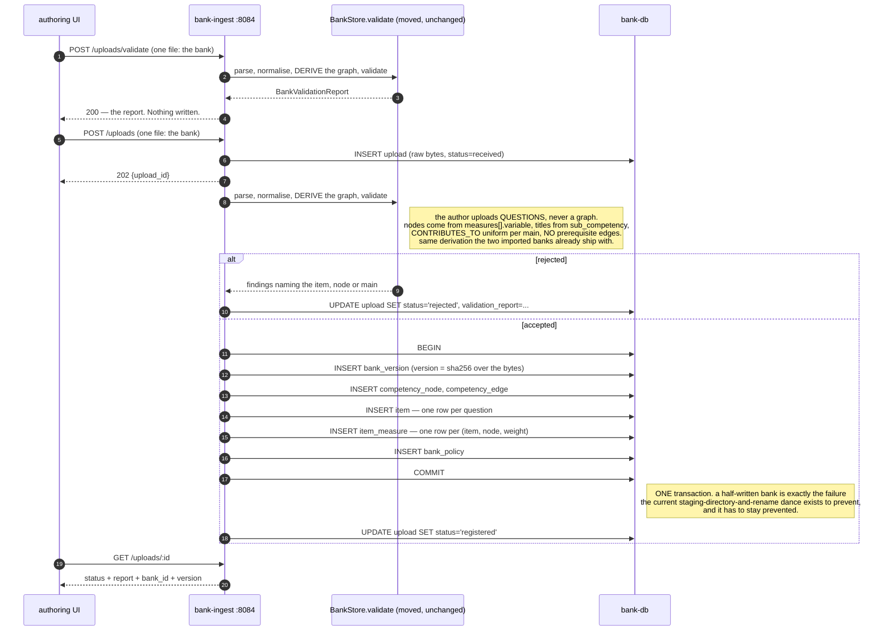

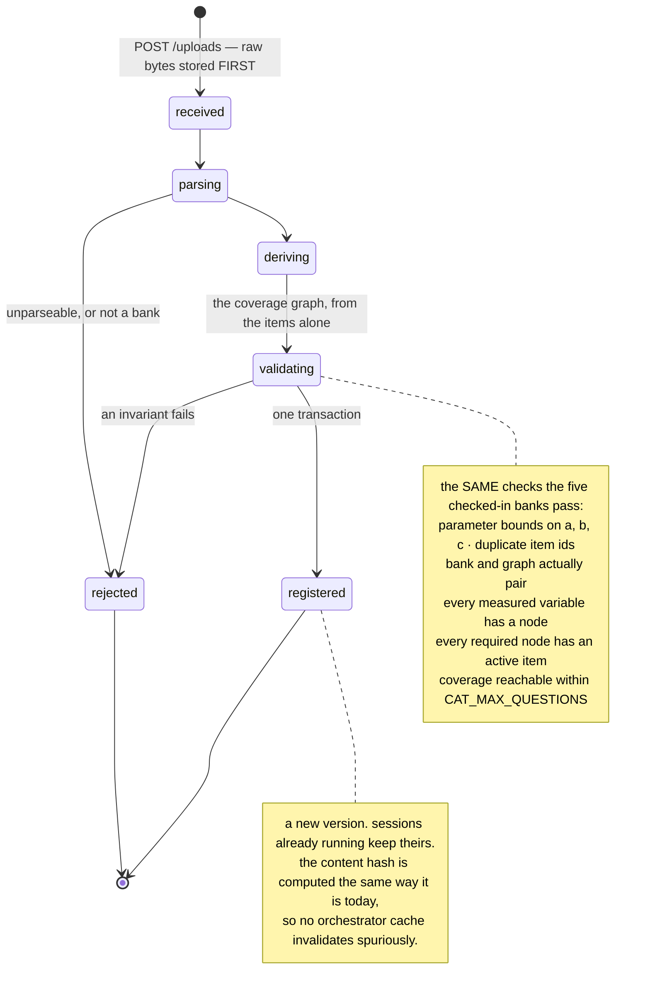

**The competency and sub-competency of every question become rows.** Items already carry
them — `"competency": "Software and AI Application Engineering"`,
`"sub_competency": "C1.1 · Core Python & programming fundamentals"`, and the authoritative
`measures: [{"variable": "C1.1", "weight": 1.0}]`. Today that is a display string and a
nested list inside a 796 KB JSON blob. After ingest it is `item_measure(item_id, node_id,
weight)` joined to `competency_node` — which is what turns *"give me the questions for C1.1
and C1.4"* from a scan of 600 items into a query.

Ingest normalises: the authoritative link is `measures[].variable`, the display strings are
kept on the item for rendering and reporting, and a mismatch between the two (an item whose
`sub_competency` label says C1.1 while its `measures` say C1.2) becomes a **warning** in the
validation report. It is not an error — the labels are cosmetic — but it is exactly the kind
of authoring slip that is invisible today.

## 2.5 The schema

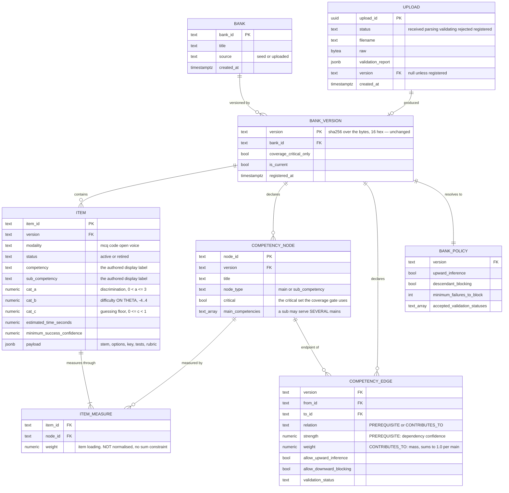

`ITEM_MEASURE` is the table the whole feature rests on. Everything else is a faithful
transcription of what is already in the files; that one is the index that makes competency
selection a set membership test instead of a scan.

The three queries that justify the schema:

```sql
-- 1. Which items measure any of the selected competencies?  (the allowlist)
SELECT DISTINCT im.item_id
FROM   item_measure im
JOIN   item i ON i.item_id = im.item_id
WHERE  i.version = $1 AND i.status = 'active'
AND    im.node_id = ANY($2);

-- 2. What does each selected main require, under this scope?  (the coverage set)
SELECT n.node_id, n.critical
FROM   competency_node n
WHERE  n.version = $1
AND    n.node_type = 'sub_competency'
AND    $2 = ANY(n.main_competencies)
AND    n.node_id = ANY($3);          -- intersected with the scope

-- 3. How many active items serve each required node?  (reachability)
SELECT im.node_id, count(DISTINCT im.item_id)
FROM   item_measure im
JOIN   item i ON i.item_id = im.item_id
WHERE  i.version = $1 AND i.status = 'active' AND im.node_id = ANY($2)
GROUP  BY im.node_id;
```

Indexes that matter: `item_measure(node_id)`, `item_measure(item_id)`, `item(version,
status)`, `competency_node(version)` with a GIN index on `main_competencies`, and
`competency_edge(version, from_id)`.

**`ITEM.payload` stays `jsonb`, deliberately.** Its shape is genuinely per-modality — a code
item carries `tests[]`, `rubric_criteria[]` and a `reference_solution`; an MCQ carries
`options[]` and an `answer_index` — and nothing in the system queries inside it. Normalising
it would buy a schema migration for every authored payload change, and no query.

## 2.6 `competency-scope` — the sub-graph and the allowlist

| method | path | notes |
|---|---|---|
| POST | `/scopes` | `{bank_id, selected[], critical_only?, include_prerequisites?}` → a `ScopeManifest`. `ETag` is the scope hash |
| POST | `/scopes/graph` | the same scope, rendered as mermaid — **the "draw the DAG" endpoint** |

**There is no `GET /scopes/{scope_id}`, and that is a correction to an earlier draft of this
document.** `scope_id` is a hash of its own inputs, and a hash cannot be inverted, so a
service holding no state cannot answer it. The two ways to make it answerable are both
worse: caching manifests turns a deterministic, horizontally scalable service into a
stateful one bound to a replica, and letting a client hand the orchestrator an id it cannot
verify means applying an allowlist nobody in that process derived.

So **the selection travels, not the id**. `CreateAssessmentRequest.scope` carries
`{selected, critical_only, include_prerequisites}` and the orchestrator builds the manifest
itself at session start. A client that called `POST /scopes` first — to preview it, or to
draw it — gets the identical `scope_id` back on the session, because the manifest is a pure
function of (bank version, normalised selection).

The manifest:

```json
{
  "scope_id":   "scp_7f3a…",
  "scope_hash": "9c1e4b70a2d8f6e3",
  "bank_id": "AIE",
  "bank_version": "4b2c9d17e0a35f68",
  "selected": ["C1.1", "C1.4", "C6"],

  "nodes": [ { "node_id": "C1.1", "title": "…", "node_type": "sub_competency",
               "critical": true, "main_competencies": ["C1"], "item_count": 17 } ],
  "edges": [ { "from": "C1.1", "to": "C1", "relation": "CONTRIBUTES_TO",
               "weight": 0.5, "weight_original": 0.1429 } ],

  "mains": [ { "main": "C1", "partial": true,  "retained_weight": 0.286,
               "required": ["C1.1", "C1.4"], "excluded": ["C1.2","C1.3","C1.5","C1.6","C6.3"] },
             { "main": "C6", "partial": false, "retained_weight": 1.0,
               "required": ["C6.1", "C6.5", "…"], "excluded": [] } ],

  "item_ids": ["C1-Q001", "…"],
  "item_count_by_modality": { "mcq": 78, "code": 39, "voice": 39 },

  "coverage": { "reachable": true, "question_budget": 12,
                "required_by_main": { "C1": 2, "C6": 7 },
                "critical_only_applied": false },

  "rejected": [],
  "dangling_prerequisites": [ { "from": "C1.1", "to": "C1.2", "direction": "leaves" },
                              { "from": "C1.3", "to": "C1.4", "direction": "enters" } ]
}
```

**It returns item ids, never items.** That is the deliberate part. ADR-0001's second boundary
is that parameters are not payloads and that one service serves items; a scope service that
returned questions would create a second item-serving path with different authorisation,
which is exactly the collapse that boundary exists to prevent. The orchestrator already holds
the whole parameter pool per bank version, so applying an id allowlist is a set intersection
— no new hop, no new leak surface, no second answer to "what is in this bank".

**It is stateless.** `scope_id` is a hash of `(bank_version, sorted(selected), critical_only,
include_prerequisites)`, so `GET /scopes/{id}` recomputes rather than looks up. The service
scales horizontally for free and a restart loses nothing — the same property that makes
`competency-graph` safe.

## 2.7 The scope algorithm

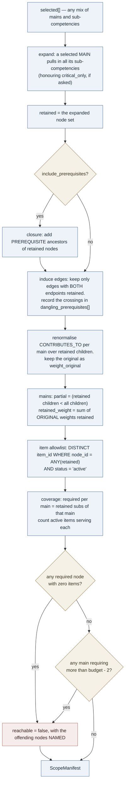

Note that `reachable: false` still produces a manifest. Refusing to answer would be worse
than answering "here is why this selection cannot be assessed" — the caller is a UI trying to
help someone build a valid selection, and the useful output is the list of competencies to
add or drop.

## 2.8 The induced sub-graph

Selecting `{C1.1, C1.4, C6}` over AIE. Authored graph first, C1's neighbourhood only:

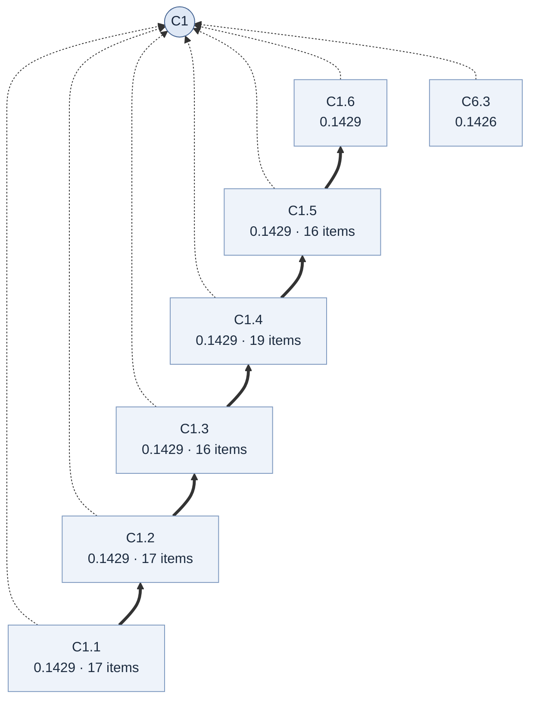

Induced by the selection `{C1.1, C1.4}`:

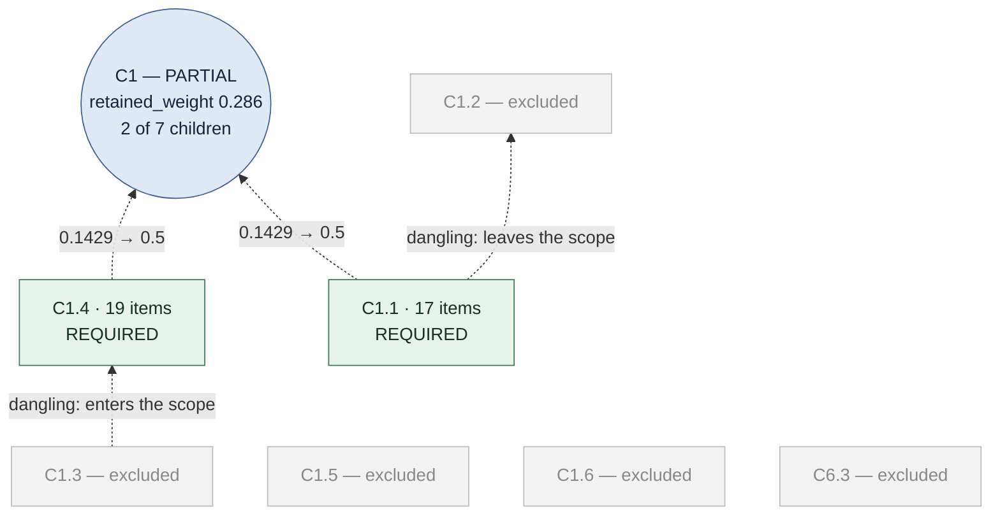

C1 keeps two of its seven children, so `retained_weight` is `0.2858` and the allowlist is 36
of the bank's 300 items.

**Shared nodes widen a scope, and the widening is not optional.** Add `C6` to that selection
and the picture changes more than it looks like it should: `C6` declares nineteen
sub-competencies, four of which — `C1.6`, `C6.3`, `C3.9`, `C3.10` — also serve `C1` or `C3`.
Selecting `C6` whole therefore retains `C1.6` and `C6.3` (lifting C1's retained weight to
`0.5713`) and opens `C3` as well, on two shared nodes and a retained weight of `0.1818`.

That main **has** to open. `rollup_outcomes` folds every outcome to its main and drops it
when that main is not in the session, so leaving `C3` closed would silently discard part of
what a `C6` question just measured. But a caller who asked for `C6` and got a `C3` result on
two items deserves to be told the difference, so `ScopeMainDTO.implied` says which mains were
chosen and which arrived by adjacency.

Three more decisions, each better named than left to happen:

**A prerequisite edge that leaves the scope.** `C1.1 → C1.2` and `C1.3 → C1.4` both cross the
boundary. The default is the **strict induced sub-graph** — only selected nodes, only edges
between them — with crossings reported in `dangling_prerequisites[]` rather than dropped
silently, and `include_prerequisites: true` available for the ancestor closure. Strict is
right here *because* propagation ships inert: enlarging an assessment on the strength of
edges the repository has measured and disabled would be using them for the one thing they
were found unfit for.

**Renormalising `CONTRIBUTES_TO`.** Two of seven children at 0.1429 leaves a main whose
declared mass sums to 0.286, not 1.0. Renormalise to 0.5 each and keep the original as
`weight_original`. But be exact about what that means: because those weights are **inert
today** (§1.11), `competency-scope` would be the first consumer of them anywhere in the
system. Renormalising changes no θ, no standard error, no band. It changes what the report is
entitled to claim the main *means*, and `retained_weight` is the number that says so.

**Coverage gets easier — a real win, not a loosening.** `sub_nodes_for_main` enumerates every
sub-competency of a main. A scoped session left to use it would report five unselected nodes
as unmeasured and veto convergence forever, ending every session on `graph_gates_waived`. The
scope's required set replaces it: C1 requires `{C1.1, C1.4}`, two nodes against a
twelve-question cap. AIE ships `coverage_critical_only=true` only because C6 has nineteen
subs against that cap — a scoped assessment can be held to *full* coverage where a whole-bank
one cannot. **This substitution is the single change to review most carefully in the whole
proposal.**

## 2.9 An assessment invoked by competencies

```mermaid
sequenceDiagram
    autonumber
    participant C as client
    participant S as competency-scope :8085
    participant O as assessment-orchestrator
    participant R as bank-registry
    participant D as bank-db

    C->>S: POST /scopes {bank_id: "AIE", selected: ["C1.1","C1.4","C6"]}
    S->>D: nodes, edges, item_measure for the current version
    D-->>S: rows
    Note right of S: expand mains · induce the sub-graph · renormalise<br/>resolve the allowlist · recompute the coverage requirement<br/>check reachability against CAT_MAX_QUESTIONS
    S-->>C: ScopeManifest

    alt reachable = false
        Note over C,S: refused HERE, with the competencies named.<br/>the alternative is a thin pool that surfaces later as a session<br/>which quietly ended on the budget escape, for reasons nobody can reconstruct.
    end

    C->>O: POST /assessments {bank_id: "AIE", scope_id}
    O->>S: GET /scopes/:scope_id
    S-->>O: the same manifest — deterministic, recomputed not looked up
    O->>R: GET /banks/AIE — pin the version
    R-->>O: profile + version
    Note right of O: the manifest's bank_version MUST match. if a bank was replaced<br/>between building the scope and starting the session, the scope<br/>describes a pool that no longer exists → 409, rebuild the scope.
    O->>R: GET /banks/AIE/items
    R-->>O: the full parameter pool, cached per version exactly as today
    Note right of O: intersect the cached pool with item_ids — a set operation, zero hops.<br/>seed one posterior per main IN THE SCOPE.<br/>pin scope_id and scope_hash into AssessmentState,<br/>beside bank_version and propagation_manifest_hash.
    O-->>C: 201 — the first question

    Note over O,R: from here the loop is UNCHANGED. selection ranks a smaller pool;<br/>the coverage gate asks the SCOPE what a main requires,<br/>not the whole graph. everything else is byte-for-byte the same.
```

**Backwards compatible by omission.** No `scope_id` means the full bank, exactly as today.
`target_variables` survives as sugar for "a scope of these mains", so no existing caller
changes and the parity test keeps passing without modification.

**Latency is unaffected by construction.** `POST /scopes` runs once per *session*, not per
response, so it sits outside the 150 ms per-response budget entirely. Ingest is off the
assessment path completely. The only database read in the hot path is `bank-registry`'s, and
it is already behind the orchestrator's per-version cache — one fetch per bank version, not
one per decision. Re-measure with `deploy/latency.py` anyway.

## 2.10 What changes in each existing service

| service | change | size |
|---|---|---|
| `bank-registry` | its store backend becomes the database; `POST` / `PUT` / `DELETE` retire | moderate — the API surface does not move |
| `assessment-orchestrator` | accept `scope_id`; fetch and pin the manifest; build the orchestrator over a **scoped bank** and a **scoped graph**; stamp `scope` on the report | confined to session construction |
| `grader` | none | zero |
| `competency-graph` | none — it reads the graph from the registry, which is unchanged | zero |
| `live-voice` | none | zero |
| `adaptive_contracts` | add `ScopeManifest`, `ScopeRequest`, `scope_id` on `CreateAssessmentRequest`, a `scope` block on the report | **additive only — `SCHEMA_VERSION` does not bump** |
| `adaptive_clients` | a `CompetencyScopeClient`, plus the two scoped wrappers | small |
| **engine (`backend/`)** | **none** | **zero — see §2.11** |

The contracts change being **additive** is the load-bearing detail. `SCHEMA_VERSION` bumps
when a field is removed or its meaning changes; adding `scope_id` and a `scope` report block
does neither, so every existing client keeps working against every service without
coordination.

## 2.11 Validated against the engine: the scope changes no engine code

This section is the answer to "does scoping break the adaptive engine". It was checked
against the code rather than reasoned about, and it produced one finding that **changed the
design** and several that confirmed it.

### The seam: two Protocols the orchestrator already depends on

`Orchestrator` is constructed with a `UnifiedBankRepository` and a graph service. Both are
already interfaces — that is what let the monolith become services in the first place. A
scope is therefore expressible as **two decorators at the adapter layer**, with no engine
change at all:

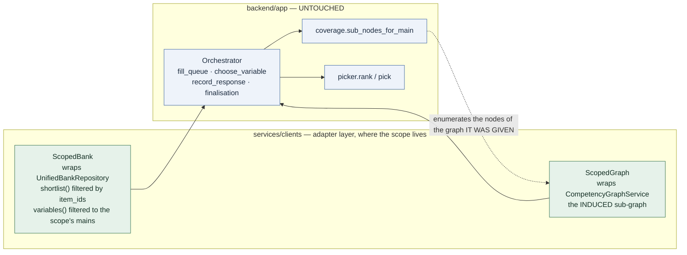

- **The item allowlist** is applied in `ScopedBank.shortlist()`, which is the single function
  every candidate pool in `fill_queue` comes from. Ranking, exposure control, the picker and
  the time filter all operate on whatever it returns and need no knowledge of the scope.
- **The coverage requirement** needs no override parameter. `sub_nodes_for_main` enumerates
  the sub-competency nodes *of the graph it was handed*. Give the orchestrator the induced
  sub-graph and the required set is correct by construction, at all four call sites, with no
  argument threaded through any of them.

### The finding that changed the design

**A sub-competency must never become a target variable.** `rollup_outcomes` folds each graded
outcome to `variable.split(".")[0]` and then drops it if that main is not in
`session_variables`. Begin a session on `["C1.1", "C1.4"]` and every outcome is computed,
propagated to the graph — and then discarded before the posterior. The session runs to the
question cap with the standard error exactly where it started, and **nothing raises, logs an
error, or looks wrong from outside.**

So the scope opens **mains**, derived from the selected nodes, and expresses the
sub-competency selection as a narrower pool and a narrower coverage requirement. This is not
a workaround: θ is estimated per main, and a target variable is by definition a thing that
has a θ.

### The findings that confirmed it

| checked | result |
|---|---|
| **A scope with only MCQ items for a main** — does the modality blueprint hang the competency open forever? | **No.** `_unmet_modality_minimums` takes `available` (which is `shortlist(variable, exclude=set())` — the *scoped* pool) and waives any minimum the pool cannot supply, with a log line. Existing code, already correct for this case. |
| **A scope that starves a main** | `fill_queue` marks it exhausted and finalisation records `bank_exhausted` with `converged=False`. Honest, and the scope's `reachable` check catches it before a candidate is involved. |
| **Corroboration and the difficulty ceiling** | computed from `max(cat.b)` over the scoped pool, guarded by an `all_available` truth test. Correct: corroboration should be relative to what this session can actually ask. |
| **Propagation** | unchanged, and deliberately given the **full** graph. A response evidencing an excluded node still records that evidence; it simply counts toward no requirement. Truncating it would be discarding a real observation. |
| **`_graph_is_compatible`** | compares bank mains to graph mains. The induced sub-graph retains its main nodes, so the check passes. |
| **The likelihood, the grid, the ranking criteria, the stopping rule** | not reached by any of this. |

### What this means for the parity test

`test_parity_inprocess_vs_services.py` runs an **unscoped** assessment. With no `scope` the
orchestrator is built exactly as it is today — the decorators are not applied at all — so
that test is untouched and remains the guard that the split changed nothing.

The scoping equivalent is asserted directly:
`TestAScopedAssessment::test_a_scope_over_everything_reports_exactly_what_no_scope_does`
runs the same seeded assessment twice, once with no scope and once with a scope naming every
competency, and compares the reports field for field. If those ever diverge, scoping is not
a restriction of the engine's behaviour but a second, slightly different instrument — and
every number in `docs/evidence.md` was measured against the first one.

### A defect this validation found, unrelated to scoping

`BankItemRef` carried no `status`, and `HttpUnifiedBank` rebuilds a `BankItem` from it — so
`BankItem.status` fell back to its `"active"` default. `JAI-600` retires 64 code items as
`inactive_missing_hidden_tests`, meaning their test suite is incomplete. In-process the
engine refuses them; over HTTP every one came back indistinguishable from a live item and
selection ranked them. The parity test never caught it because it runs bank `DA`, which has
no retired items.

Fixed by carrying `status` on the ranking view, which is where it belongs — whether an item
may be administered is a selection fact, not a payload. Additive, so `SCHEMA_VERSION` does
not move.

## 2.12 What this changes about the measurement

| | |
|---|---|
| **θ stays per main.** | Selecting sub-competencies changes what is asked and what coverage requires. It does **not** create a θ per sub-competency — `rollup_outcomes` folds every sub-competency outcome up to its main before the posterior ever sees it. Per-sub-competency ability estimation is a different and much larger change, and it is not this one. |
| **A partially scoped main is estimated from a corner of itself.** | Which is precisely what the coverage gate exists to prevent. It must be reported as partial, with `retained_weight` named, and must never be compared against a full-scope score. `decision_status` — already `certified` / `provisional` / `not_assessed` on every reported competency — is the right home for that rather than a new field nobody reads. |
| **`scope_hash` sits beside `bank_version` and `propagation_manifest_hash`.** | The repository's own rule: a number that cannot say what configuration produced it cannot be reproduced or believed. |
| **An unassessable scope is refused at selection time.** | With the competencies named, before a candidate is involved. |
| **Nothing in the likelihood changes.** | `L(θ) = [P(θ)^s · (1−P(θ))^(1−s)]^w`, the 41-point grid, the 3PL core, the ranking criteria, the stopping rule. A scope narrows the pool and the coverage requirement. It does not touch the arithmetic. |
| **The bands stay provisional.** | Operational score bands remain provisional until independent response data passes the psychometric and human-grader gates. Scoping does not change that and must not be read as changing it. |

## 2.13 What does not change

The engine library and its single implementation of the psychometrics. The posterior
isolation invariant and `InferredSignalDTO`. The two read paths on `bank-registry` and the
ETag on each. The config fingerprint on `/health`. Bank-version pinning per session. The
grader as the only component that executes anything. The candidate boundary — the answer key
never transits the orchestrator, and the presented item is projected server-side.

And `services/tests/test_parity_inprocess_vs_services.py`, which asserts that one seeded
assessment produces identical reports in-process and across services. It must still pass,
unchanged, after the seeder has loaded the five banks into Postgres. If it does not, the
number to distrust is not the one in the report.

## 2.14 Migration, in phases

Each phase is deployable and reversible on its own. Nothing here requires a flag day.

The order below is not the one this document first proposed. Scoping went first because it
needs **no datastore at all** — `bank-registry` already serves both the graph and the
item-to-competency links — so it could ship and be verified before any database decision was
made. Ingest went second, against the existing two-layer bank store. The database is last,
and it is the only phase that is still a plan.

| phase | what ships | status | reversible by |
|---|---|---|---|
| **1** | `competency-scope`, read-only. The orchestrator does not know about it — a manifest can be inspected before anything consumes it | **done** | not deploying it |
| **2** | The orchestrator accepts `scope`. The scoped pool and the scoped coverage gate | **done** | omitting `scope`, which is the default |
| **3** | `bank-ingest`: one file in, a derived graph, a registered bank. Writes to the existing store | **done** | `INGEST_API_ENABLED=false` |
| **4** | `bank-registry`'s write endpoints return **410 Gone** naming the replacement | **done** | re-adding them |
| **5** | The schema, the SQL store, the seeder, and a parity suite proving it answers identically to the file store | **done** | it is additive; nothing reads it yet |
| **6** | `bank-registry` and `bank-ingest` read and write the database behind their existing APIs | **done, opt-in** | unset `BANK_DATABASE_URL` |

Phase 6 ships **behind a switch, not as the default.** `BANK_DATABASE_URL` empty keeps the
file store, which is what the whole suite runs against and what `docker compose up` starts;
`docker compose --profile db up` starts Postgres and points both bank services at it. The
default path stays the tested-by-default path until the database one has run somewhere real.

It needed no new abstraction. `registry.use_store()` already existed as the seam — *"for a
service that resolves its store directory at startup rather than from the environment"* —
and `SqlBackedBankStore` subclasses `BankStore`, overriding only where the bytes come from.
Everything else is inherited: the version-keyed caches, the bank loader, `validate()` and
its rules about coverage, pairing and duplicate ids. Reimplementing any of that against SQL
would have created a second set of answers to questions that already have one.

**Phase 4 is done.** `bank-registry`'s four write endpoints return **410 Gone** naming the
replacement — 410 rather than 404, and the routes kept rather than deleted, because a 404
says "wrong URL" and sends somebody hunting for a typo while a 410 naming the replacement is
the only thing a client integrated against the old path will actually read.

What made it possible was the `competencies` block (§2.3): a curated critical set and shared
nodes are now expressible in the uploaded file. What the old path could still express and
ingest cannot is an **authored prerequisite edge** — expert judgement with a strength
attached. That is a gap in a feature which ships inert at both the deployment and the bank
level, and which only `scripts/validate_prerequisite_edges.py`, against a real session
corpus on disk, may ever enable. An API authoring data that is disabled on arrival and
promoted by a different mechanism was not worth keeping.

`ADMIN_API_ENABLED` is gone with it, and so are `BankSubmission` and `BankItemSubmission` —
the types that described a request body no endpoint accepts. That is a removal rather than
an addition, so `SCHEMA_VERSION` moves to **1.1.0**, which is exactly what it exists to
signal.

**And the upload surface is now one endpoint.** `POST /uploads`, `PUT /uploads/{id}` and
`POST /uploads/validate` became `PUT /banks/{bank_id}`, with `?dry_run=true` for the
validate case. Register and replace were separate verbs, which made the difference between
them something a client had to know before it could act — and made a retried POST able to
fail for having succeeded. A bank is identified by its id and its content, so uploading one
is idempotent by nature: the same bytes under the same id produce the same version whether
it is the first upload or the fifth.

**Phase 5 shipped ahead of it**, because it is additive and needs nothing settled: the
schema, `SqlBankStore`, the seeder, and `test_sql_store_parity.py`. Nothing reads the
database yet — that is phase 6 — and the parity suite is what makes pointing a service at it
safe when the time comes.

Phases 1–3 are deployable and reversible on their own, and none required a change to
`backend/`.

Phase 5 is the one that can go wrong quietly, which is why it ships alone: **the seeder must
produce the same content hash the file store produces.** If it does not, every orchestrator
cache invalidates, the parity test's pinned expectations move, and five banks quietly become
five different banks with the same names.

Until phase 6, `bank-ingest` and `bank-registry` share a volume — one writer, one reader, with
the registry's version-keyed caches picking up a change on the next stamp check. That works,
and it is precisely the arrangement a database replaces: two processes agreeing about a
directory is a weaker guarantee than one transaction.

## 2.15 How the new parts degrade

| what fails | what happens | mitigation |
|---|---|---|
| `bank-db` unreachable | `bank-registry` cannot serve items; no new session can begin; **running sessions continue** from their per-version caches until they need a payload | the caches are the mitigation, and they are already there |
| `bank-ingest` down | no bank can be uploaded. **No assessment is affected** — it is off the hot path entirely | none needed |
| `competency-scope` down | scoped sessions cannot begin. Unscoped ones are unaffected | fall back to `target_variables` over mains |
| a scope references a bank version that has been replaced | **409** at `POST /assessments`, naming the version drift | rebuild the scope; the manifest is cheap and deterministic |
| the seeder runs twice | nothing — it is idempotent on `(bank_id, version)` | assert it in the test suite, not in a runbook |
| a partially applied ingest | impossible — one transaction | the database is the mitigation; this is strictly better than the rename dance |

## 2.16 Alternatives considered

**Fold ingest into `bank-registry`.** Rejected. The registry serves candidate-facing reads on
the hot path; the write path is an authoring concern with a completely different security
posture and a completely different availability requirement. Keeping them together is the
current arrangement and it is the reason `ADMIN_API_ENABLED` has to exist.

**Have `competency-scope` return the items.** Rejected. It would create a second
item-serving path with different authorisation, collapsing the parameters-versus-payloads
boundary that ADR-0001 chose deliberately. Returning ids costs the orchestrator a set
intersection against a pool it already holds.

**Neo4j for the graph.** Rejected. The largest graph in the repository is 36 nodes and 67
edges; the largest plausible one is a few hundred. Sub-graph induction over that is
microseconds in memory. A second datastore buys graph-native traversal that nothing needs,
and costs a second consistency problem between the items and the graph they pair with —
which is exactly the `graph_bank_mismatch` failure the validator already guards against.

**Keep files as the source of truth and use the database as an index.** Rejected, but it is
the closest call. It would preserve the current store untouched and make competency queries
fast. It also means two sources of truth for the same bank, an index that can drift from the
files it indexes, and no transaction around a bank arriving. The current staging-and-rename
dance exists precisely because there is no transaction available; a database is the thing
that makes it unnecessary.

**A θ per sub-competency.** Deferred, not rejected. It is the honest way to report a
sub-competency-scoped assessment, and it is a much larger change — it touches the prior, the
stopping rule, the report and the evidence base behind every band. `evidence.md` already
records a 9.9pp cost for one θ per main competency; the equivalent for sub-competencies has
not been measured. Scoping is useful without it, provided the report is honest about what a
partial main means.

## 2.17 Risks, and what stays open

**Still no authentication anywhere** — and a database makes an unauthenticated write path
strictly worse than a volume did. This proposal does not close that gap;
`ADMIN_API_ENABLED` becomes `INGEST_API_ENABLED` and that is all. Saying so plainly is the
point, because a proposal that introduces an upload endpoint reads as though it had thought
about auth. See [operations.md](operations.md).

**Sessions remain in one process.** The seam exists and is documented; the blocker is a
retention-policy decision about candidate response data, not a technical one. Adding a
database for banks does not settle it — and quietly reusing that database for sessions would
settle it by accident, which is worse than leaving it open. Explicit non-goal.

**Postgres becomes a single point of failure** for a system that currently has none. Every
read path that was a file read becomes a network call, and `bank-registry` — which today can
reach nothing at all — acquires a dependency and loses the strongest sentence in its egress
row.

**The seeder is load-bearing and easy to get subtly wrong.** See phase 0.

**A derived graph is flatter than an authored one, and scoping is where that shows.** An
uploaded bank gets one main per sub-competency by id prefix, so it has no shared nodes — and
shared nodes are exactly what makes a scope widen beyond what was selected. A scope over a
derived bank will therefore behave more simply than the worked example above, which is
convenient and also means the `implied` path gets no exercise on uploaded content. The two
checked-in banks with derived graphs (`AIE-JR-V3`, `JAI-600`) are the only place that
combination is observable today.

**Nothing derives `critical` from evidence.** Every sub-competency of an uploaded bank is
required, because there is no signal in a bank file that says otherwise. That is the strict
choice and it is the safe one, but it means an author's only lever over session length is
how many sub-competencies they declare — and the failure, when it comes, is an upload
rejected for `coverage_unreachable` rather than a bad assessment.

**`retained_weight` is a new number nobody has calibrated.** It is descriptive rather than
inferential, which is why it is safe to ship; but the first time it appears next to a band on
a report, somebody will read it as a confidence. The report copy matters more than the
computation.

**The two `loading`s stay two.** Item-to-node weights are not normalised and have no sum
constraint; node-to-main weights sum to 1.0. A scope touches only the second. Conflating them
is the standing trap in this codebase, and none of this makes it better or worse.

---

- [architecture.md](architecture.md) — the loop, the measurement, the graph
- [microservices.md](module.md) — what runs, and what crosses the wire
- [ADR-0001](adr/0001-service-boundaries.md) · [ADR-0002](adr/0002-engine-as-a-library.md) — the seams, and what changed when the code moved
- [competency-graph.md](competency-graph.md) — the two loadings, the policy lattice, the coverage gate
- [bank-schema.md](bank-schema.md) — the bank JSON, field by field
- [configuration.md](configuration.md) — every setting, and which are safe to change
- [evidence.md](evidence.md) — the measurements behind the defaults, and why propagation ships inert
